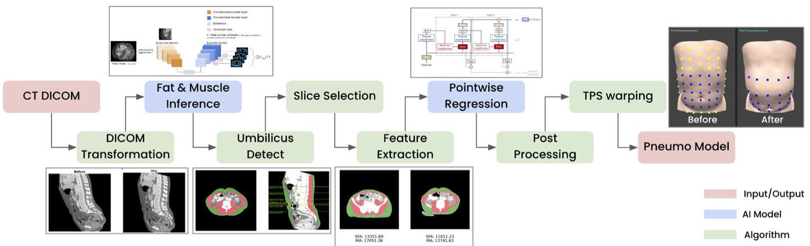
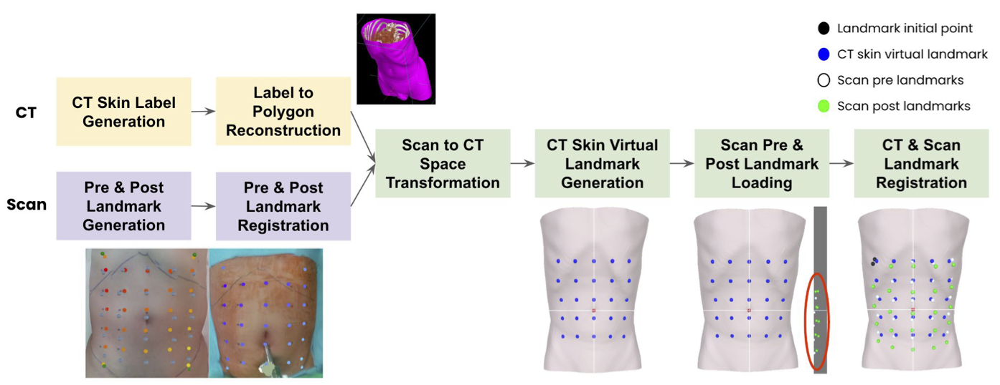
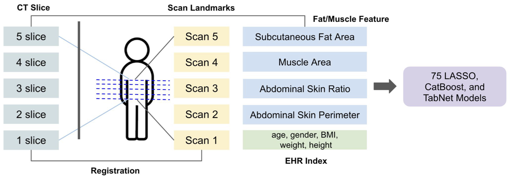
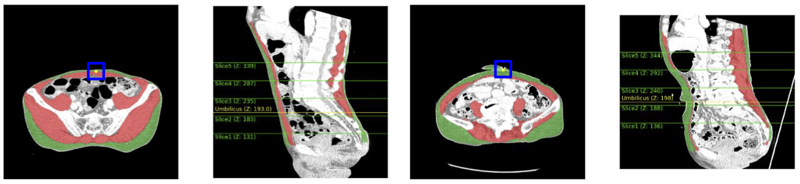
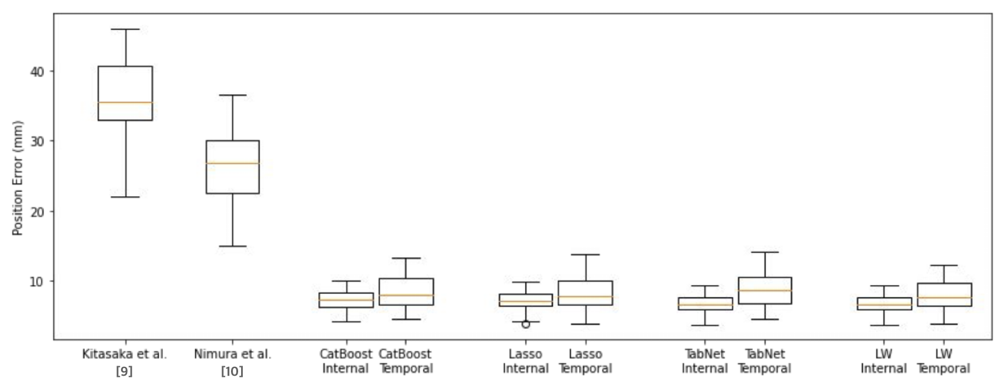
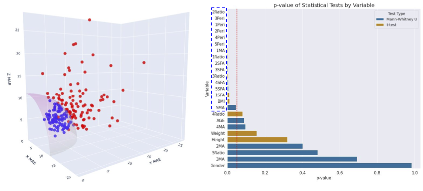
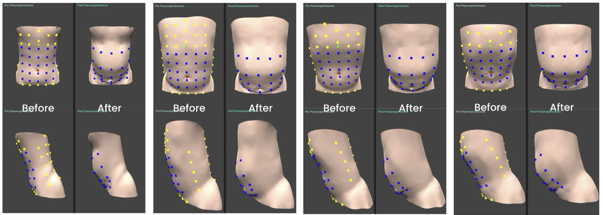

# APSP
🎉 **[PRIME-MICCAI 2024] Automated Patient-Specific Pneumoperitoneum Model Reconstruction for Surgical Navigation Systems in Distal Gastrectomy** 🎉 
→ [**PDF**](https://link.springer.com/chapter/10.1007/978-3-031-74561-4_7)

## Table of Contents

- [APSP](#apsp)
  - [Table of Contents](#table-of-contents)
  - [Introduction](#introduction)
    - [1. Overview](#1-overview)
    - [2. Motivation](#2-motivation)
    - [3. Method](#3-method)
      - [3.1 Data Preparation](#31-data-preparation)
      - [3.2 Feature Extraction](#32-feature-extraction)
      - [3.3 Displacement Regression](#33-displacement-regression)
      - [3.4 Pneumoperitoneum Warping](#34-pneumoperitoneum-warping)
    - [4. Experiments](#4-experiments)
      - [4.1 Displacement Prediction and Model Comparison](#41-displacement-prediction-and-model-comparison)
      - [4.2 Feature Importance via p-Value Analysis](#42-feature-importance-via-p-value-analysis)
      - [4.3 Qualitative Comparisons](#43-qualitative-comparisons)
    - [5. Conclusion and Future Work](#5-conclusion-and-future-work)
  - [Software](#software)
    - [Installation](#installation)
    - [Usage](#usage)
    - [Directory Structure](#directory-structure)
    - [Configuration](#configuration)
    - [Running the Code](#running-the-code)
      - [What `main.py` Does](#what-mainpy-does)
    - [Results Visualization](#results-visualization)
    - [Data Availability](#data-availability)
    - [License](#license)


## Introduction
### 1. Overview

We propose a novel framework for reconstructing **patient-specific pneumoperitoneum models** to aid surgical navigation in minimally invasive gastrectomy. Traditional methods often rely on simplified physics-based simulations that may not capture the rich variability across patients. Our approach introduces a **data-driven landmark displacement** pipeline that learns to predict abdominal deformations directly from paired pre- and post-insufflation data. By combining structural features from preoperative CT scans (muscle/fat metrics, demographic information) with accurate surface landmarks captured via intraoperative 3D scanning, we train regression models to estimate per-landmark displacement. Finally, we warp the entire CT-based abdomen model using thin-plate-spline interpolation, producing a **realistic** and **patient-specific** surgical field.

**Figure 1**: Overview of our framework. We start by detecting reference slices (umbilicus) in the CT volume, extracting muscle/fat features, and training separate regressors per landmark to predict 3D displacement after CO₂ insufflation.


### 2. Motivation

**Challenges in MIGS Navigation.** Minimally invasive gastric surgery requires stable, reliable anatomical context. However, the standard laparoscopic setup involves significant nonrigid deformations caused by CO₂ insufflation, which can misalign patient images and hamper accurate surgical guidance.

**Shortcomings of Physics-Based Models.** While physical simulations (e.g., mass-spring or finite-element models) exist, they typically demand detailed patient-specific tissue properties and may struggle to generalize to a wide variety of body compositions and organ configurations.

**Data-Driven Adaptation.** Our framework learns deformation patterns directly from real patient data. By systematically collecting **paired preoperative CT** and **intraoperative 3D scans**, we can train regression models that naturally account for inter-patient differences—such as BMI, age, or muscle/fat distribution—thus enhancing accuracy in the resulting pneumoperitoneum model.


### 3. Method

An overview of our pipeline appears in **Figure 1** (above). It consists of four main steps: (i) **Data Preparation**, (ii) **Feature Extraction**, (iii) **Displacement Regression**, and (iv) **Pneumoperitoneum Warping**.

**Figure 2**: Data generation workflows.

#### 3.1 Data Preparation

- **Cohort & Data Collection.** We enrolled 210 patients undergoing robotic distal gastrectomy, collecting preoperative CT scans in a 15° reverse Trendelenburg position and intraoperative 3D surface scans before/after CO₂ insufflation (~12 mmHg).  
- **Ground Truth Landmarks.** We identified 25 corresponding landmarks in both CT and 3D scans. These landmarks capture anatomically consistent points (e.g., near the umbilicus, lateral abdominal flanks).  
- **Displacement Vectors.** Each landmark’s 3D position in the post-insufflation scan minus its pre-insufflation CT-based location yields a labeled displacement vector—our primary regression target.

**Figure 3**: From feature extraction to landamark regression.

#### 3.2 Feature Extraction

1. **Umbilicus Slice Detection.** We locate the slice containing the umbilicus in each patient’s CT using a contour-based detection algorithm. This step normalizes the abdomen’s vertical reference, ensuring consistent feature localization across different patient anatomies.

**Figure 4**: Umbilicus detection from CT slices.

2. **3D UNet Segmentation.** We segment subcutaneous fat and muscle in the CT volume with a deep 3D UNet. This model achieves high dice scores (> 0.90 for both fat and muscle).

3. **Landmark-Specific Feature Computation.** For each landmark slice, we extract four key statistics:

   - Subcutaneous Fat Area (SFA)
   - Muscle Area (MA)
   - Width–Height Ratio of the Abdominal Contour
   - Abdomen Perimeter

    We concatenate these with demographic data (BMI, age, gender, weight, height) to form a 9D feature vector per landmark.

#### 3.3 Displacement Regression

1. **Model Setup.** Each of the 25 landmarks has three coordinate axes (x, y, z) to predict, resulting in 75 regression tasks.  
2. **Regression Approaches.** We compare three families of models:  
   - **Lasso:** Linear regressor with ℓ₁ penalty for feature selection.  
   - **CatBoost:** Gradient boosting with built-in handling of categorical and numerical features.  
   - **TabNet:** A transformer-style neural network specialized for tabular data.  
3. **Training Objective.** We minimize the mean absolute error (MAE) between predicted and ground-truth landmark displacements. Cross-validation guides hyperparameter tuning, and we conduct a separate temporal test to check generalization.

#### 3.4 Pneumoperitoneum Warping

After predicting the displacement of each landmark, we perform a **thin-plate-spline (TPS) interpolation**. This smoothly warps the entire 3D CT-based model to reflect the CO₂-inflated patient anatomy. Consequently, our method provides a **personalized pneumoperitoneum** model that can be integrated into a surgical navigation system, assisting with optimal trocar placement and anatomical orientation.


### 4. Experiments

We evaluated our method on 210 patient cases, partitioning data into 150 patients for training, 38 for internal validation, and 22 for temporal validation. Below, we highlight **displacement prediction errors**, **landmark-level analysis**, and **statistical feature significance**.

#### 4.1 Displacement Prediction and Model Comparison

**Quantitative Performance.** As summarized in the following table, our best approach (“Landmark-Wise,” which picks the best model per landmark) achieves the lowest MAE, **6.82 mm ± 1.80**, on the temporal test set.

<div align="center">

| **Model**         | **Temporal MAE (mm) ± SD** |
|-------------------|----------------------------|
| Lasso             | 7.24 ± 2.16               |
| CatBoost          | 7.26 ± 2.12               |
| TabNet            | 6.83 ± 1.80               |
| **Landmark-Wise** | **6.82 ± 1.80**           |

</div>

**Figure 5**: Performance comparisons.

#### 4.2 Feature Importance via p-Value Analysis

**Figure 6**: Group Analysis with MAE=11mm

We further assessed feature significance by dividing patients into two groups based on a prediction MAE threshold of 11 mm. The left panel in Figure 5 shows a **sphere discrimination plot**, where each point represents a patient’s displacement error. The right panel presents the **p-value analysis** of demographic (e.g., BMI, age) and fat–muscle features across these two error groups. Any feature lying below the red dashed line (p < 0.05) is deemed statistically significant. This analysis confirms the critical influence of certain patient-specific attributes (notably high BMI and subcutaneous fat) on error magnitude, underscoring the necessity of incorporating them into our data-driven framework.


#### 4.3 Qualitative Comparisons
**Figure 7** shows before/after reconstruction results for representative patients. Our method faithfully captures overall abdominal distension.

**Figure 7**: Qualitative visualization of abdominal reconstruction.


### 5. Conclusion and Future Work

We introduced a **data-driven** framework for modeling pneumoperitoneum in minimally invasive gastrectomy. By fusing CT-derived features with patient demographics, our approach learns to accurately predict landmark displacements and warp the abdomen to a **CO₂-inflated** state. This personalized technique addresses key limitations in physics-based deformation modeling and supports integration into real-time surgical navigation.

**Future Directions** include:
- **Multi-Institutional Validation.** Extending data collection to diverse populations and anatomical variations.  
- **Volumetric Tissue Modeling.** Incorporating deeper 3D morphological features (e.g., fat volumes, organ shapes) to capture complex surgical scenarios.  
- **Broader Surgical Use-Cases.** Generalizing our pipeline to other minimally invasive procedures (e.g., colectomy, gynecologic surgeries) and exploring dynamic, real-time updates as insufflation pressure changes.

Ultimately, our method paves the way for **high-fidelity, patient-specific surgical navigation**, optimizing trocar placement, organ localization, and overall procedural safety in the operating room.

## Software
### Installation

To set up the environment and install the required dependencies, follow these steps:

1. Clone the repository:
    
    ```bash
    git clone https://github.com/PRIME-MICCAI24-APSP/APSP.git
    cd APSP
    
    ```
    
2. Install the required packages:
    
    ```bash
    pip install torch torchvision torchaudio --extra-index-url <https://download.pytorch.org/whl/cu117>
    pip install pandas numpy scikit-learn matplotlib tqdm
    
    ```
    

### Usage

1. Set up the directory structure as follows:
    
    ```
    /workspace
    ├── config
    ├── data
    ├── src
    └── main.py
    
    ```
    
2. Place your configuration files in the `config` directory and the data files in the `data` directory.
3. Update the paths in the `main.py` file if necessary.

### Directory Structure

Here is the overview of the directory structure:

```
/workspace
├── config
│   ├── tabnet_train_all.json
│   ├── lasso_temporal.json
│   └── catboost_test.json
├── data
│   └── pneumo_dataset.xlsx
├── src
│   ├── preprocessor.py
│   ├── lasso_trainer.py
│   ├── tabnet_trainer.py
│   ├── catboost_trainer.py
│   ├── file_operator.py
│   ├── error_visualizer.py
│   └── displacement_saver.py
└── main.py

```

### Configuration

The configuration files for the models should be placed in the `config` directory. Each configuration file should be a JSON file specifying the parameters for training and evaluation.

Example of a configuration file (`config/tabnet_train_all.json`):

```json
{
    "n_splits": 10,
    "seed": 42,
    "save_model": false,
    "id": "p_num",
    "specific_test": true,
    "train_set_eval": true,
    "train_set_eval_cv_type": "train_all",
    "cv_type": "train_all",
    "valid_cases": ["S003", "S004", "S005", "S009", "S010",
                    "S012", "S013", "S015", "S016", "S017",
                    "S018", "S019", "S020", "S021", "S022",
                    "S023", "S026", "S027", "S028", "S029",
                    "S031", "S035"],
    "gpu_ids": [6],
    
    "tabnet_params": {
        "n_d": 2,
        "n_a": 2,
        "n_steps": 3,
        "gamma": 1.3,
        "n_independent": 2,
        "n_shared": 2,
        "lambda_sparse": 0.01,
        "optimizer_fn": "Adam",
        "optimizer_params": {
            "lr": 0.02
        },
        "mask_type": "entmax",
        "scheduler_params": {
            "step_size": 50,
            "gamma": 0.9
        },
        "scheduler_fn": "StepLR",
        "epsilon": 1e-15
    },
    "fit_params": {
        "eval_metric": ["mae"],
        "max_epochs": 100,
        "patience": 50,
        "batch_size": 16,
        "virtual_batch_size": 16,
        "num_workers": 0,
        "drop_last": false,
        "loss_fn": "mse_loss"
    }
}

```

### Running the Code

To run the code, execute the `main.py` script:

```bash
python main.py
```

#### What `main.py` Does

When you run `main.py`, it performs the following tasks:

1. **Configuration Loading**: Reads the configuration files specified in `config_paths`. These files contain parameters for model training and evaluation.
2. **Data Preprocessing**: Utilizes the `CPreprocessor` class to load and preprocess the data according to the settings in the configuration files.
3. **Model Training**: Depending on the model specified in each configuration file (`LassoTrainer`, `TabNetTrainer`, `CatBoostTrainer`), it trains the model using the preprocessed data.
4. **Evaluation**: Evaluates the trained model using cross-validation or a specific test set, as defined in the configuration.
5. **Results Saving**: Saves the results of the evaluation, including model performance metrics, to the `results` directory.
6. **Visualization**: Uses the `ErrorVisualizer` class to generate visualizations of the model performance.
7. **Displacement Saving**: For specific test cases, uses the `DisplacementSaver` class to save predicted displacements to text files.

The script ensures that each step is executed sequentially, and the results are saved and visualized appropriately.


### Results Visualization

The results of the model training and evaluation will be saved in the `results` directory. You can use the `error_visualizer.py` script to visualize the performance of the models.

### Data Availability

To protect patient privacy, only three sample cases demonstrating the best, worst, and typical performance are publicly available. Theses sample cases can be found in the `data` directory.

### License
This project is licensed under the MIT License.
